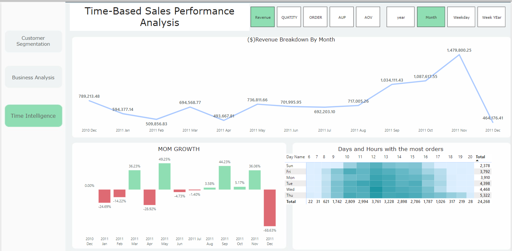

# Sales-Performance-Analysis-And-Customer-Segmentation-Project-

## Table Of Content 
   Introduction
   
   Objective 
   
   SoftWare Listing 
   
   ## Data Analysis 

   SQL Code Breakdown 

   PowerBI Dashboard 

   Insights 

   Recommedation 

# Introduction 
   
Understanding customer behavior and transactional patterns in the evolving era of online retail is essential for driving strategic decision-making and optimizing sales strategies. This analysis aims to explore UK-based online retail transactions from December 1, 2009, to December 9, 2011. The dataset includes all-occasion giftware sales, providing insights into consumer preferences, purchasing habits, and market trends within the specified timeframe.

# Objective 

The objective is to examine various aspects of sales performance, customer behavior, and product performance, as well as conduct a temporal analysis. 

### Sales Performance

**Total Revenue Analysis:**
- What is the total revenue, quantity, order count, and average price over time (monthly, quarterly, annually)?
- How do sales metrics trend over different periods (seasonality)?

**Average Order Value (AOV):**
- What is the overall AOV across all customers and regions?
- How does AOV vary by region/country?

**Revenue by Region:**
- Which regions or countries generate the highest and lowest revenue?
- How does the revenue distribution look across different regions?

**Revenue by Product:**
- Which products contribute the most to total revenue?
- What is the revenue distribution across different product categories?

### Customer Behavior

**Customer Segmentation:**
- How can customers be segmented based on their purchase behavior (e.g., high spenders, frequent buyers)?
- What is the revenue contribution from different customer segments?

### Product Performance

**Product Popularity:**
- Which products are the best-sellers?
- What are the top-performing product categories?

### Temporal Analysis

**Busiest Time Periods:**
- What are the busiest times of the day, week, or month for sales?

# Software Listing
The analysis utilized specific software tools to segment customers and visualize the data effectively. 

- **SQL Server** was used to segment customers based on Recency, Frequency, and Monetary value (RFM).
- **Power BI** was used for data visualization.

This combination of SQL Server and Power BI enabled detailed customer segmentation and provided clear, interactive visual representations of the data for strategic decision-making.

# Data Analysis 
To perform the RFM Analysis on SQL. 
- **Step 1** :Create a Table to Store RFM Scores and Segment Information 

```sql
 CREATE TABLE RFM(
    CustomerID Int,
    Recency INT,
    Frequecy INT,
    Monetary FLOAT,
    RFM_segment VARCHAR(10)
    );
```

- **Step 2**: Calculate the Recency, Frequency and Monetar for each customer.

```sql
with RFM_analysis as (
        SELECT 
        CustomerID, 
        DATEDIFF(day,MAX(INVOICEDATE),'2011-12-09' ) AS RECENCY,
        COUNT(DISTINCT InvoiceNo) as FREQUENCY,
        SUM(Revenue) AS MONETARY
    FROM RFMOnlineRetail
    GROUP BY CustomerID
    )
```
- **Step 3**: Insert data into RFM table and  Assign RFM Scores
```sql 
INSERT INTO RFM (CustomerID,Recency,Frequecy,Monetary)
     SELECT 
     CustomerID, 
     NTILE(5) OVER (ORDER BY RECENCY DESC),
     NTILE(5) OVER (ORDER BY FREQUENCY ),
     NTILE(5) OVER (ORDER BY MONETARY  )
     FROM RFM_analysis;
```
**NTILE FUNCTION** was used to rank customers based on their recency ,Frequency, Monetary . The Function divided the customers into 5 groups based on their recency ,Frequency, Monetary
For Recency, customers with the lowest recency get a higher score(5) and customers with the highest recency 
get a lower score(1). Frequency and Monetary, customer with the highest numbers get higher score(5) and customers with lower numbers, get low lower score (1).  The resulting scores (from 1 to 5) are inserted into the RFM table. 

- **Step 4**: Add a new column named customer segement   
```sql 
ALTER TABLE RFM
    add Customer_segement nvarchar(50);
```

**Concatenet The RFM Score**
```sql
 UPDATE RFM
    SET RFM_segment = CONCAT(RECENCY,Frequecy,MONETARY)
```

- **Step 5**: Segment customers based on the RFM SCORES
```sql
select CustomerID,Recency, Frequecy,Monetary,RFM_segment,
        case when [Recency] >= 4 and [Frequecy] >= 4 and [Monetary] >= 4 then 'Champion'
             when [Recency] >= 2 and [Frequecy] <= 2 and [Monetary] >= 4 then  'Big Spenders'
             when [Recency] >= 3 and [Frequecy] >= 3 and [Monetary] >= 3 then 'Loyal Customer'
             when [Recency] >= 4 and [Frequecy] <= 2 and [Monetary] <= 3 then 'New Customers'
             when [Recency] >= 3 and [Frequecy] >= 3 and [Monetary] <= 2 then  'Low Spender'
             when [Recency] >= 2 and [Frequecy] >= 2 and [Monetary] >= 2 then 'Promising'
             when [Recency] <= 1 and [Frequecy] >= 3 and [Monetary] >= 3 then  'Can not lose'
             when [Recency] >= 2 and [Frequecy] >= 1 and [Monetary] >= 1 then  'About To sleep'
             when [Recency] <= 1 and [Frequecy] >= 2 and [Monetary] >= 1 then   'At Risk'
                             
 else 'lost'
            end as Customer_segment
From RFM
 ```

#Power BI Dashboard 

https://app.powerbi.com/links/VsTGSxCcmN?ctid=056e52ff-3fcb-4f6b-8251-481ea120fd41&pbi_source=linkShare


### Dashboard Overview

The dashboard shows total sales using different sales metrics. It provides insights into the previous month when you filter for a specific month and shows the percentage change.

In another part of the dashboard, you can see the top and bottom performing countries and SKUs, dynamically displaying rankings from the top 10 to the top 1. It also allows you to view performance using multiple sales metrics in a single visualization.


### Customer Segmentation Dashboard Overview

The dashboard segments customers using RFM (Recency, Frequency, Monetary) analysis. Customer RFM scores are divided into five ranks (1 to 5):

- **Recency:**
  - Customers with recent purchases are assigned scores of **1 or 2**.
  - Customers with moderately recent purchases are assigned a score of **3**.
  - Customers with older purchases are assigned scores of **4 or 5**.

- **Frequency and Monetary:**
  - Customers with low purchase frequency and spending are assigned scores of **1 or 2**.
  - Customers with moderate purchase frequency and spending are assigned a score of **3**.
  - Customers with high purchase frequency and spending are assigned scores of **4 or 5**.

For each segment, the dashboard displays the total number of customers and total sales. Additionally, recommended marketing actions are provided for each segment.



### Time-Based Sales Performance Dashboard

The dashboard provides an overview of sales performance over time, allowing users to see sales trends across multiple periods (year, month, weekday, week of the year) using various sales metrics, including:

- **Revenue**
- **Quantity**
- **Order Count**
- **Average Order Value (AOV)**
- **Average Unit Price**

Key features of the dashboard include:

- **Month-over-Month (MOM) Growth:**
  - Displays MOM growth by revenue to track sales performance changes month by month.

- **Busiest Days and Hours:**
  - Highlights the busiest days and hours with the highest number of orders, helping users understand peak sales times.

### Market Insights for Countries

#### Top Performing Countries: Driving Sales Excellence
The top 5 countries contributing the most to company sales are:
1. United Kingdom
2. Netherlands
3. Germany
4. France
5. Ireland

#### Least Performing Countries: Identifying Growth Opportunities
The countries with the lowest sales performance include:
1. Saudi Arabia
2. Bahrain
3. Czech Republic
4. South Africa (RZA)
5. Brazil

#### Average Order Units: Market Leaders in Customer Engagement
The top 5 countries with the highest average order units are:
1. Netherlands
2. Australia
3. Lebanon
4. Japan
5. Brazil

#### Revenue Insights: Understanding the UK Market
The United Kingdom has the highest revenue contribution but is not in the top 10 countries for average order value (AOV). This indicates a broad customer base with frequent but smaller purchases.

### Strategic Recommendations

#### Boosting AOV in the United States: Leveraging a Wide Consumer Base

**Increase AOV:**
- **Upselling and Cross-Selling:** Encourage customers to purchase higher-value items or additional complementary products.
- **Promotions and Bundling:** Implement promotional campaigns that bundle products or offer discounts on larger purchases to boost AOV.

By focusing on these strategies, the company can enhance its sales performance and customer engagement across various regions.

### Time-Based Analysis

#### Peak Performance Periods

**Highest Revenue Month:**
- **November 2011:** The company generated the most revenue, accounting for 15% of total sales.

**Lowest Revenue Month:**
- **December 2010:** The company saw the least revenue contribution at 5%, with a significant decrease of 68.63%.

#### Busiest Operational Times

**Busiest Day:**
- **Thursday:** The busiest day for the company.

**Peak Hour:**
- **12:00 PM:** The busiest time of day.

### Recommendations

#### Maximizing Revenue During Peak Times

**Capitalizing on November Trends:**
- **Seasonal Promotions:** Implement targeted promotional campaigns in November to leverage the historical peak performance.
- **Inventory Management:** Ensure adequate stock levels and staffing to meet increased demand during this peak period.
- **Marketing Blitz:** Increase marketing efforts leading up to and during November to capture a larger market share.

#### Optimizing Operations on Busiest Days and Times

**Enhancing Thursday Sales:**
- **Flash Sales and Promotions:** Schedule flash sales or special promotions on Thursdays to capitalize on the high traffic.
- **Staffing Optimization:** Ensure sufficient staff availability and efficient customer service on Thursdays to handle the increased volume.

**Leveraging Peak Hour at 12:00 PM:**
- **Targeted Marketing:** Schedule email and social media marketing campaigns to go live just before 12:00 PM to attract more customers.
- **Operational Efficiency:** Optimize logistics and inventory replenishment to ensure smooth operations during peak hours.
